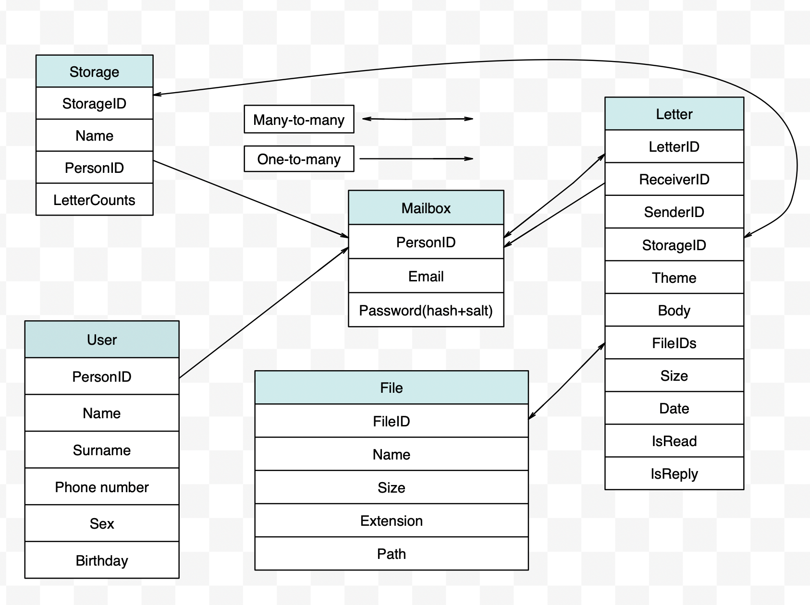

# Почта

## Расчет нагрузки

### Целевая аудитория
- Россия, страны СНГ
- Каждый пользоветель в среднем проводит на сайте около 4ч 5м в месяц(8,1 минут в день). Источник: https://radar.yandex.ru/yandex?month=2021-08
### MVP
- Регистрация/авторизация
- Отправка/пересылка писем
- Чтение писем
- Прикрепление файлов(изображений, архивов)
- Удаление писем

### Нагрузка
Согласно оффициальной статистике на август 2021 (https://radar.yandex.ru/yandex?month=2021-08)
- Месячная аудитория - 19 390 981
- Дневная аудитория - 5 836 187
  
При этом доля мобильного приложения составляет 30%.

### Расчеты
Согласно опубликованной информации от Mail.ru, количество активных аккаунтов почты составляет ~100млн и ~46млн активных, 
средний размер хранилища пользователя составляет 20GB пользователей (https://corp.mail.ru/en/company/portal/)

Рассмотрим среднестатистического пользователя, пользующийся почтой 8,1 минут в день. 
Для дальнейших расчетов примем следущее:
1) Средний пользователь отправляет в день 3 письма(2 без вложения - ~5KB, 1 c вложением - 500KB)
2) Средний пользователь получает 10 писем(33% из которых - с вложениями)  
3) Пользователь заходит в почту 8 раз в день (~ на 1 мин)   
4) Согласно https://habr.com/ru/post/321756/ письма с вложениями составляют 10%, учитывая современные реалии выберем цифру в 33%
5) Среднее количество запросов пользователя за время пребывание в сервисе ~500
6) Пиковая активность ~60% от общего количества посещений в день (5.8 * 10^6 * 0.6 = 3 480 000)

Расчитаем общее значение RPS:

      RPS = (5.8 * 10^6 * 500)/(24 * 60 * 60) ~ 33000

### Среднее количество действий пользователя по типам в день (RPS) (согласно MVP)

 - <b>Регистрация/авторизация</b>

Приняв во внимание пункт 3, расчитаем средний RPS для авторизации:

      RPS = (5.8 * 10^6 * 8)/(24 * 60 * 60) ~ 537

- <b>Отправка/пересылка писем</b>

Согласно пунту 1, объем данных 2 * 5 KB + 1 * 500KB = 510KB:

      RPS = (5.8 * 10^6 * 3)/(24 * 60 * 60) ~ 201

      Трафик: (5.8 * 10^6 * 510)/(24 * 60 * 60)  3423KB ~ 3,3MB

      Пиковое значение (пункт 6): 3.48 * 10^6 * 510KB ~ 13540 Gbit/sec

- <b>Чтение писем</b>

Согласно пунту 2, объем данных 7 * 5 KB + 3 * 500KB = 1535KB:

      RPS = (5.8 * 10^7)/(24 * 60 * 60) ~ 641

      Трафик: (5.8 * 10^6 * 1535)/(24 * 60 * 60)  ~ 100MB

      Пиковое значение (пункт 6): 3.48 * 10^6 * 1535 ~ 40 750 Gbit/sec

- <b>Прикрепление файлов(изображений, архивов)</b>

В среднем 1 отправленное письмо имеет вложение(пункт 1), объем данных 1 * 500KB = 500KB, тогда:

      RPS = (5.8 * 10^6)/(24 * 60 * 60) ~ 67

      Трафик: (5.8 * 10^6 * 500)/(24 * 60 * 60)  ~ 32MB

      Пиковое значение (пункт 6): 3.48 * 10^6 * 500 ~ 13 275 Gbit/sec

- <b>Удаление писем</b>

Согласно https://www.statista.com/statistics/420391/spam-email-traffic-share/ спам составляет порядка 45.1% от 
полученных писем(на март 2021г). Тогда из пункта 2: 10 * 45.1 / 100 = 4.5 (пусть 4 писем в среднем удаляет пользователь)

      RPS = (5.8 * 10^6 * 4)/(24 * 60 * 60) ~ 268

## Логическая схема

## Функциональная схема

### Mailbox

PersonID     | Email          | Password      |
------------ | -------------- | ------------- | 
bigint       | varchar(20)    | varchar(32)   | 

Максимальный вес сущности <b>Mailbox</b> для одного пользователя:

    8 + 20 + 32 = 60 байт ~ 0,06 Кбайт

### User

PersonID  | Name          | Surname      | Phone number  | Sex      | Birthday       | 
------    | ------------- | ------------ | ------------- | -------- | -------------- |
bigint    | varchar(20)   | varchar(20)  | bigint        | bool     | timestamp(UTC) | 

Максимальный вес сущности <b>User</b> для одного пользователя:

    8 + 20 + 20 + 8 + 1 + 4 = 61 байт ~ 0,06 Кбайт

В данной таблице хранится основная информация по пользователе.

### Storage

StorageID | Name          | PersonID      | LetterCounts    | 
--------- | ------------- | ------------- | --------------- | 
bigint    | varchar(20)   | bigint        | bigint          | 

Максимальный вес сущности <b>Storage</b>:

    8 + 20 + 8 + 8 = 44 байт ~ 0,04 Кбайт

### Letter

LetterID  | ReceiverID  | SenderID         | StorageID     | Theme       | Body             | FileIDs         | Size | Date           | isRead | isReply  |
------    | ----------- | ---------------- | ------------- | ----------- | ---------------- | --------------- | ---- | -------------- | ------ | -------- |
bigint    | bigint      | bigint array[5]  | bigint        | varchar(50) | varchar(1000000) | bigint array[5] | int  | timestamp(UTC) | bool   | bool     |

Максимальный вес сущности <b>Letter</b>:

    8 + 8 + 5*8 + 8 + 50 + 1 000 000 + 5*8 + 4 + 4 + 1 + 1 = 1 000 164 байт ~ 1 Mбайт

Сервис позволяет отправлять до 5 прикрепленных файлов и до 5 пользователям.

### File

FileID    | Name          | Size      | Extension       | Path         |
--------- | ------------- | --------- | --------------- | ------------ |
bigint    | varchar(20)   | int       | varchar(8)      |  varchar(20) |

Максимальный вес сущности <b>File</b>:

    8 + 20 + 4 + 8 + 20 = 60 байт ~ 0,06 Кбайт

В качестве СУБД будет использоваться LevelDB.

Некоторые свойства LevelDB:
* хранилище типа ключ-значение;
* ключ и значение это произвольный массив байт;
* данные хранятся упорядоченно, порядок можно задавать;
* прямой и обратный итератор для обхода данных;
* множественное атомарное обновление;
* поддержка снимков;
* сжатие данных через Snappy.

Данная СУБД позволяет разделить данные каждого пользователя по папкам, что ускоряет выполнение запросов по получению данных пользователя.

Таблица со списком пользователей будет храниться в key-value хранилище в redis (в LevelDB нет удобной возможности шардинга), а прикрепленные файлы в S3 хранилище 
(Cold boxes - "холодное" хранение, на более медленных и менее дорогостоящих дисках), т.к нет смысла считать все файлы "горячими" (только относительно недавние).

При запросе пользователем последних писем происходит загрузка не всех писем, а лишь небольшой ее части (около 20 штук). В таком случае
если пользователя интересуют более старые письма используются механизмы автоподгрузки или пагинации.

Таким образом можно расчитать RPS получения списка последних писем для всех активных пользователей:

    Согласно пункту 2) пользователь получает 10 писем 
    
    Кол-во писем: 5.8 * 10^6 * 10 ~ 58 000 000 писем

    C вложениями: 58 000 000 * 0,33 ~ 19 140 000

    Без вложений: 58 000 000 * 0,67 ~ 38 860 000

    Объем писем с вложениями(~500Кб):

    19 140 000 * 500Кб ~ 9Тб

    RPS = (5.8 * 10^6 * 3)/(24 * 60 * 60) ~ 201

    Объем писем без вложений(~5Кб):

        38 860 000 * 5Кб ~ 185Гб

    RPS = (5.8 * 10^6 * 7)/(24 * 60 * 60) ~ 470

Согласно источнику https://web.archive.org/web/20151020214950/http://symas.com:80/mdb/microbench/ 
При размере данных в 100B и 128MB кэша:

Random Reads - 137,231 ops/sec
Random Writes - 176,929 ops/sec
Batch Random Writes - 229,095 entries/sec

Данные загружаются на сервер со скоростью записи жесткого диска.