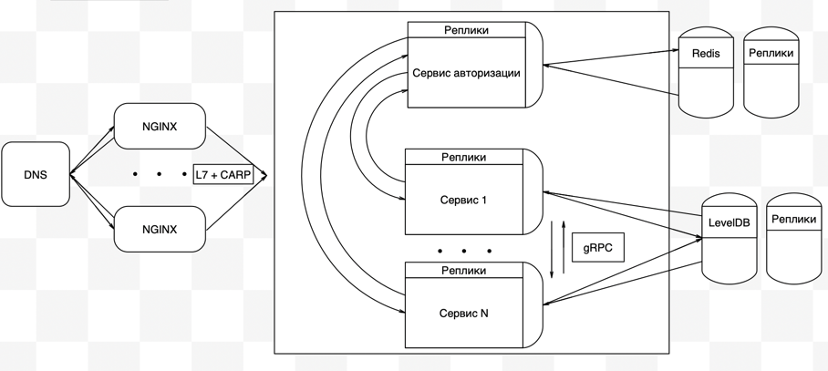

# Почта

## 1. Расчет нагрузки

### Целевая аудитория
- Россия, страны СНГ
- Каждый пользоветель в среднем проводит на сайте около 4ч 5м в месяц(8,1 минут в день). Источник: https://radar.yandex.ru/yandex?month=2021-08
### MVP
- Регистрация/авторизация
- Отправка/пересылка писем
- Чтение писем
- Прикрепление файлов(изображений, архивов)
- Удаление писем

### Нагрузка
Согласно оффициальной статистике на август 2021 (https://radar.yandex.ru/yandex?month=2021-08)
- Месячная аудитория - 19 390 981
- Дневная аудитория - 5 836 187
  
При этом доля мобильного приложения составляет 30%.

### Расчеты
Согласно источнику https://sudonull.com/post/120133-How-we-accelerated-the-search-in-YandexMail-and-at-the-same-time-freed-25-servers-Yandex-Blog
примерный объем всех писем пользователей на 2013 год составляет около 10PB (с учетом того что пользователей интернета в России за 8 лет 
по официальной статистике увеличилось на 20% (в странах СНГ и того больше), можно сделать вывод об увеличении этого объема пользовательских даннных 
как минимум раз в 10). Учитывая показатель активных аккаунтов по Яндекс Почты (~70 млн), расчитаем средний размер
одного почтового ящика:

    100PB / 70 * 10^6 ~ 1,5 GB

Рассмотрим среднестатистического пользователя, пользующийся почтой 8,1 минут в день. 
Для дальнейших расчетов примем следущее:
1) Средний пользователь отправляет в день 1,75 письма(67% без вложения - ~5KB, 33% c вложением - 500KB) (источник https://prosperitymedia.com.au/how-many-emails-are-sent-per-day-in-2021/#:~:text=The%20are%20approximately%205.59%20billion,person%20has%201.75%20email%20accounts.)
2) Средний пользователь получает 10 писем(33% из которых - с вложениями)  
3) Пользователь заходит в почту 8 раз в день (~ на 1 мин)   
4) Согласно https://habr.com/ru/post/321756/ письма с вложениями составляют 10%, учитывая современные реалии выберем цифру в 33%
5) Среднее количество запросов пользователя за время пребывание в сервисе ~40 согласно статистике
6) Пиковая активность ~ в два раза больше дневной нормы (5.8 * 10^6 * 2 = 11 600 000)

Расчитаем общее значение RPS:

      RPS = (5.8 * 10^6 * 40)/(24 * 60 * 60) ~ 2686
      RPS(в контексте загрузки ресурсов) = (5.8 * 10^6 * 500)/(24 * 60 * 60) ~ 30000

### Среднее количество действий пользователя по типам в день (RPS) (согласно MVP)

 - <b>Регистрация/авторизация</b>

Приняв во внимание пункт 3, расчитаем средний RPS для авторизации(сильно не влияет на нагрузку из-за длительного кэширования сессий):

      RPS = (5.8 * 10^6 * 8)/(24 * 60 * 60) ~ 537

- <b>Отправка/пересылка писем</b>

Согласно пунту 1, объем данных 1.75 * 0.67 * 5 KB + 1.75 * 0.33 * 500KB = 295KB:

      RPS = (5.8 * 10^6 * 3)/(24 * 60 * 60) ~ 118

      Трафик: (5.8 * 10^6 * 295)/(24 * 60 * 60)  2013KB ~ 2MB

      Пиковое значение (пункт 6): 11.6 * 10^6 * 295KB ~ 20540 Gbit/sec

- <b>Чтение писем</b>

Согласно пунту 2, объем данных 7 * 5 KB + 3 * 500KB = 1535KB:

      RPS = (5.8 * 10^7)/(24 * 60 * 60) ~ 641

      Трафик: (5.8 * 10^6 * 1535)/(24 * 60 * 60)  ~ 100MB

      Пиковое значение (пункт 6): 3.48 * 10^6 * 1535 ~ 130 000 Gbit/sec

- <b>Прикрепление файлов(изображений, архивов)</b>

В среднем 1.75 * 0.33 отправленное письмо имеет вложение(пункт 1), объем данных 1.75 * 0.33 * 500KB = 288KB, тогда:

      RPS = (5.8 * 10^6)/(24 * 60 * 60) ~ 39

      Трафик: (5.8 * 10^6 * 500)/(24 * 60 * 60) ~ 18.5MB

      Пиковое значение (пункт 6): 3.48 * 10^6 * 500 ~ 23 488 Gbit/sec

- <b>Удаление писем</b>

Согласно https://www.statista.com/statistics/420391/spam-email-traffic-share/ спам составляет порядка 45.1% от 
полученных писем(на март 2021г). Тогда из пункта 2: 10 * 45.1 / 100 = 4.5 . В среднем пользователи почти никогда не удаляют сообщениями
 поэтому данная метрику можно отнести к погрешности. В дополнение к этому у большинства почтовых сервисов существуют алгоритмы 
по автоматической очистке спама.

## 2. Логическая схема

## 3. Физическая схема

### Mailbox

PersonID     | Email          | Password      |
------------ | -------------- | ------------- | 
bigint       | varchar(20)    | varchar(32)   | 

Максимальный вес сущности <b>Mailbox</b> для одного пользователя:

    8 + 20 + 32 = 60 байт ~ 0,06 Кбайт

### User

PersonID  | Name          | Surname      | Phone number  | Sex      | Birthday       | 
------    | ------------- | ------------ | ------------- | -------- | -------------- |
bigint    | varchar(20)   | varchar(20)  | bigint        | bool     | timestamp(UTC) | 

Максимальный вес сущности <b>User</b> для одного пользователя:

    8 + 20 + 20 + 8 + 1 + 4 = 61 байт ~ 0,06 Кбайт

В данной таблице хранится основная информация по пользователе.

### Storage

StorageID | Name          | PersonID      | LetterCounts    | 
--------- | ------------- | ------------- | --------------- | 
bigint    | varchar(20)   | bigint        | bigint          | 

Максимальный вес сущности <b>Storage</b>:

    8 + 20 + 8 + 8 = 44 байт ~ 0,04 Кбайт

Эта таблица служит собой таблицей в которой хранятся в удобном формате письма пользователей, заклеченные в строгую иерахию - 
1 пользователю присваиваются папки со множеством его писем, что ускоряет процесс выборки писем.
### Letter

LetterID  | ReceiverID  | SenderID         | StorageID     | Theme       | Body             | FileIDs         | Size | Date           | isRead | isReply  |
------    | ----------- | ---------------- | ------------- | ----------- | ---------------- | --------------- | ---- | -------------- | ------ | -------- |
bigint    | bigint      | bigint array[5]  | bigint        | varchar(50) | varchar(1000000) | bigint array[5] | int  | timestamp(UTC) | bool   | bool     |

Максимальный вес сущности <b>Letter</b>:

    8 + 8 + 5*8 + 8 + 50 + 1 000 000 + 5*8 + 4 + 4 + 1 + 1 = 1 000 164 байт ~ 1 Mбайт

Сервис позволяет отправлять до 5 прикрепленных файлов и до 5 пользователям.

### File

FileID    | Name          | Size      | Extension       | Path         |
--------- | ------------- | --------- | --------------- | ------------ |
bigint    | varchar(20)   | int       | varchar(8)      |  varchar(20) |

Максимальный вес сущности <b>File</b>:

    8 + 20 + 4 + 8 + 20 = 60 байт ~ 0,06 Кбайт

В качестве СУБД будет использоваться LevelDB.

Некоторые свойства LevelDB:
* хранилище типа ключ-значение;
* ключ и значение это произвольный массив байт;
* данные хранятся упорядоченно, порядок можно задавать;
* прямой и обратный итератор для обхода данных;
* множественное атомарное обновление;
* поддержка снимков;
* сжатие данных через Snappy.

Данная СУБД позволяет разделить данные каждого пользователя по папкам, что ускоряет выполнение запросов по получению данных пользователя.

Таблица со списком пользователей будет храниться в key-value хранилище в Redis (в LevelDB нет удобной возможности шардинга), а прикрепленные файлы в S3 хранилище 
(Cold boxes - "холодное" хранение, на более медленных и менее дорогостоящих дисках), т.к нет смысла считать все файлы "горячими" (только относительно недавние).

При запросе пользователем последних писем происходит загрузка не всех писем, а лишь небольшой ее части (около 20 штук). В таком случае
если пользователя интересуют более старые письма используются механизмы автоподгрузки или пагинации.

Таким образом можно расчитать RPS получения списка последних писем для всех активных пользователей:

    Согласно пункту 2) пользователь получает 10 писем 
    
    Кол-во писем: 5.8 * 10^6 * 10 ~ 58 000 000 писем

    C вложениями: 58 000 000 * 0,33 ~ 19 140 000

    Без вложений: 58 000 000 * 0,67 ~ 38 860 000

    Объем писем с вложениями(~500Кб):

    19 140 000 * 500Кб ~ 9Тб

    RPS = (5.8 * 10^6 * 3)/(24 * 60 * 60) ~ 201

    Объем писем без вложений(~5Кб):

        38 860 000 * 5Кб ~ 185Гб

    RPS = (5.8 * 10^6 * 7)/(24 * 60 * 60) ~ 470

Согласно источнику https://web.archive.org/web/20151020214950/http://symas.com:80/mdb/microbench/ 
При размере данных в 100B и 128MB кэша:

Random Reads - 137,231 ops/sec
Random Writes - 176,929 ops/sec
Batch Random Writes - 229,095 entries/sec

Данные загружаются на сервер со скоростью записи жесткого диска.

## 4. Технологии

<b>Технологии</b>              | <b>Область применения</b>  | <b>Подробности</b>        | 
------------------------------ | ---------------------------| ---------           |
Golang                         | Бэкенд                     | Низкий порог вхождения, огромная стандартная библиотека, многопоточность из коробки, отличная масштабируемость, принцип Communicating sequential processes(CSP). В качестве роутера, благодаря лучшим показателям по производительности, был выбран fasthttp. Для разбиения приложения на сервисы будет использоваться GRPC как самый оптимальный (Объем передаваемого трафика в Protobuf кратно отличается от передачи данных в формате JSON) | 
TypeScript/JavaScript, CSS,HTML| Фронтенд                   | Самые популярные решения. Под этот стек написано огромное количество библиотек и фреймворков, обширная документация. Технологии уже много лет держат высокий уровень актуальности. Благодаря TypeScript появляется возможность ускорить разработку из-за отлавливания ошибок при компиляции и обезопасить код от непредсказуемого поведения в будущем          |
LevelDB, Redis                 | Системы хранения           | LevelDB позволяет разделить данные каждого пользователя по папкам, что ускоряет выполнение запросов по получению данных пользователя. Таблица со списком пользователей будет храниться в key-value хранилище в Redis (в LevelDB нет удобной возможности шардинга), а прикрепленные файлы в S3 хранилище (Cold boxes - "холодное" хранение, на более медленных и менее дорогостоящих дисках), т.к нет смысла считать все файлы "горячими" (только относительно недавние). |
Nginx                          | Баласировщик               | Благодаря L7 балансировке даже мультиплексируемые клиенты с очень разными трафиками по запросам будут эффективно сбалансированы по бэкендам. Будет использоваться CARP за счет быстрой замены упавших серверов.

Система будет представлять собой микросервесную архитектуру, благодаря которой будет повышена отказоустойчивость и обеспечена разделимость.

В данном проекте подразумевается использование HTTPS и HTTP2 для связи клиента с бэкендом и микросервисов друг с другом (GRPC работает поверх HTTP2).Также будет реализована связь с помощью websocket протокола, для отображения новых пришедших пользователю сообщений в режиме реального времени.

## 5. Схема проекта

## 6. Список серверов

С учетом того, что средний размер почтового ящика равен 1,5GB (Пункт 1), расчитаем среднее количество писем:

    1,5GB = (X * 0.33% * 500KB) + (X * 0.67% * 5KB)
    
    X ~= 9 500 писем (для простоты счета возьмем значение 10000)

Из этой общей массе писем, в "горячим" хранении нуждается около 10% писем(последние)

Объем "горячего" хранения писем всех пользователей:

    1. Письма без вложений - 70 000 000 * (10 000 * 10%) * 0.67 * 5KB ~ 218TB
    2. Письма c вложениями - 70 000 000 * (10 000 * 10%) * 0.33 * 500KB ~ 10 750TB

Объем "холодного" хранения писем всех пользователей:

    1. Письма без вложений - 70 000 000 * (10 000 * 90%) * 0.67 * 5KB ~ 1 970TB
    2. Письма c вложениями - 70 000 000 * (10 000 * 90%) * 0.33 * 500KB ~ 98 000TB

* Объем "горячих" данных одного пользователя:

    
    1. Письма без вложений - (10 000 * 10%) * 0.67 * 5KB ~ 3.8МB
    2. Письма c вложениями - (10 000 * 10%) * 0.33 * 500KB ~ 161MB
    
    Итого: 0.12KB(данные о пользователе) + 3.8MB + 161MB ~= 165MB

* Объем "горячих" данных одного пользователя:

    1. Письма без вложений - (10 000 * 90%) * 0.67 * 5KB ~ 30МB
    2. Письма c вложениями - (10 000 * 90%) * 0.33 * 500KB ~ 1.3GB

    Итого: 0.12KB(данные о пользователе) + 30MB + 1.3GB ~= 1.33GB

Конфигурация сервера для хранения "горячих" данных:

| CPU(cores) | RAM(GB) | SSD(GB)/2-unit(10) |
|------------|---------|---------|
| 8         | 32      | 4096 x 10    |

С учетом запаса под рост данных в 50% на нем уместится 20 480GB/171MB ~ **130 000  пользователей**.
Всего таких серверов понадобится 70 000 000 / 130 000 = **550 штук**
Надежность этих данных требуется высокая, поэтому нам придется делать по 2 реплики к каждому.
**Итого 1100 реплик, 1650 серверов всего.**

Что касается архивных данных , то тут мы воспользуемся конфигурацией.

| CPU(cores) | RAM(GB) | HDD(TB)/2-unit(10) |
|------------|---------|---------|
| 8         | 32      | 18 * 10   |

На такой сервер с учетом запаса данных в 66% на нем уместится 90TB/1.33GB ~ **70 000  пользователей**.
Всего таких серверов понадобится 70 000 000 / 70 000 = **1000 штук**
На холодные сервера не сильная нагрузка и не такие высокие требования к надежности, поэтому нам хватит
по 1 реплики к каждому. **Итого еще 1000 реплик , 2000 серверов всего.**

Сервер Redis: 
Из 30000 запросов примерно в половине требуется информация о пользователе.
Примем RPS = 15 000. Согласно [redis_bench](https://gist.github.com/sfc/216135) мы видим, что 8 ядер
нам более чем достаточно.Возьмем

| CPU(cores) | RAM(GB) | SSD(GB) |
|------------|---------|---------|
| 8         | 32      | 512    |

Однако надежность этого сервиса крайне важна, поэтому сделаем ему целых 3
реплики.Итого **4 сервера**. У Redis'а есть удобная встроенная репликация, что является плюсом.

Фронтенд: 
Основная нагрузка на фронтенд сервера - парсинг HTML файлов.Для этого воспользуемся библиотекой
на языке Go - exp/html.Учитвая [bench](https://habr.com/ru/post/163979/),
можно посчитать , что на 32-ядерном сервере будет 3000 распаршенных документов в секунду.Если предположить,
что все наши 15000 запросов на фронтенд будут требовать парсинг HTML,то можем получить итоговое количество серверов.

Много физической памяти фронтенд серверу не особо надо,она будет потрачена в основном на кеширование запросов и
хранения документов, а вот RAM ему понадобиться побольше.Возьмем:

| CPU(cores) | RAM(GB) | SSD(GB) |
|------------|---------|---------|
|   32       | 64      | 512    |

В количестве **5 штук**.Так же добавим каждому по 2 запасных.Итого **15 серверов**

Балансировщик: 

В пункте 1 было расчитано RPS в контексте загрузки ресурсов (30000). Согласно [nginx_test](https://www.nginx.com/blog/testing-the-performance-of-nginx-and-nginx-plus-web-servers/)
при среднем объеме требуемого пользователю контента в 10MB , мы видим , что можем обойтись 16 ядрами и 32GB RAM.
Объем документной составляющей примерно 5MB на человека.Тогда подсчитаем, что
5 * 5 800 000(количество пользователей в день) = 25 000 000 MB/день ~ 300MB/s
Но учтем , что это при распределении на 24 часа. На деле значение может быть выше.

| CPU(cores) | RAM(GB) | SSD(GB) |
|------------|---------|---------|
|   16       | 64      | 512    |

**Возьмем 10 серверов**.Но оставлять их без поддержки - опасно.Возьмем еще по 2(**Итого 30**) запасных дополнительно,которые будут
подменять первый при падении.Между ними настроим [CARP](https://en.wikipedia.org/wiki/Common_Address_Redundancy_Protocol).
При падении главного веб-сервера его IP подхватит другой и полностью заменит его.

Бэкенд: 

Бэкенд должен соответствовать производительности БД, но благодаря микросервисной архитектуре мы
грамотно разбиваем нагрузку. Большая часть запросов - получение картинок(50/50 статика - пользовательские) и вспомогательные запросы для
клиентской стороны.Из суммарных 30000RPS на бэкенд приходится лишь примерно 5000, которые и распределяются по
микросервисам. Если мы возьмем 5 микросервисов, 2 для авторизации и 3 для работы с сообщениями,то каждому из них
будет достаточно следующих параметров:

| CPU(cores) | RAM(GB) | SSD(GB) |
|------------|---------|---------|
|   8        | 16       | 512      |

Каждому из 5 микросервисов нужен по 1 запасному.Итого **10 серверов.**
Вспомним про перенос данных из "горячих" серверов в "холодные".Тогда будет 6 серверов для работы с
сообщениями, к каждому по запасному.Итого **8 серверов основных. 16 серверов всего**.

